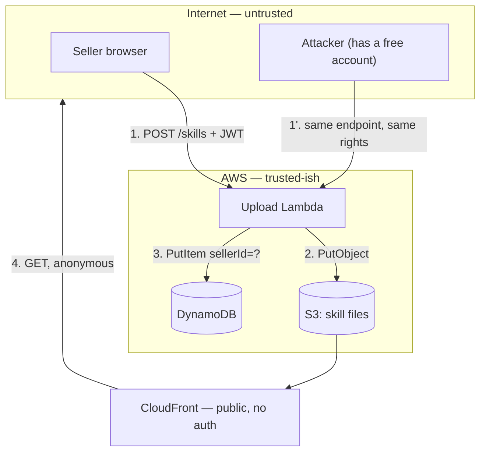

# Practical Threat Modelling for Small Teams Skill

## 1. Philosophy

Threat modelling has a reputation problem: people imagine a week-long workshop producing a 60-page artifact that ages into a lie. The useful version is ninety minutes with a whiteboard and four questions, run before the code exists, producing five tickets.

1. **Do it while the design is still cheap to change.** A threat found in a design doc costs an hour. The same threat found in a pentest costs a sprint plus a re-test. Found by a researcher in your inbox, it costs a disclosure timeline and a weekend. Every argument for threat modelling is this cost curve; there isn't a second argument.
2. **Trust boundaries are where the bugs are.** Nothing interesting happens inside a process. Everything interesting happens where data crosses from a place with one set of assumptions into a place with another — browser to API, API to queue, your service to a vendor's, tenant A's row to tenant B's query. Draw those lines and you've done 70% of the work.
3. **Model the system you're building, not the one in the diagram.** The architecture doc says the worker reads from the queue. The worker also has prod DB credentials in its env because someone needed a migration once. Model the credentials, not the intention.
4. **A threat without a mitigation is a rumor; a mitigation without a test is a hope.** The output of a threat model is tickets with owners, and the good ones ship with a test that fails on the vulnerable version.
5. **Rank ruthlessly, ship the top five.** Every system has thirty plausible threats. A team of three will fix five this quarter. A model that lists thirty and ranks none gets zero fixed, because "where do I start" is answered by "nowhere."
6. **Assume the attacker has your source, your API docs, and an account.** Your repo may go public; your JS bundle already is; your API is enumerable. Any control whose strength depends on nobody knowing the endpoint exists is not a control.

## 2. Tech Stack

- **OWASP Threat Dragon** — https://github.com/OWASP/threat-dragon — licensed **Apache-2.0**. Free, open-source DFD editor with STRIDE-per-element prompts, storing models as JSON you can commit next to the code. Its real value is that the model lives in the repo and shows up in a PR diff.
- **STRIDE** — the threat taxonomy (Spoofing, Tampering, Repudiation, Information disclosure, Denial of service, Elevation of privilege), originally from Microsoft and now industry-standard vocabulary. It's a checklist against forgetting, not a methodology to be devout about.
- **OWASP Cheat Sheet Series** — https://github.com/OWASP/CheatSheetSeries — **CC-BY-SA 4.0**. Where you look up the mitigation once STRIDE has told you which threat class you're in.
- **Mermaid** — https://github.com/mermaid-js/mermaid — **MIT**. For DFDs as text in the repo. A diagram in a PNG on a wiki is a diagram that will be wrong within one quarter.
- **`git-secrets` / `gitleaks`** — https://github.com/gitleaks/gitleaks — **MIT**. Referenced in §3.6 for the credential-exposure mitigations this process reliably surfaces.

This skill is an independent, original guide; it is not affiliated with or endorsed by the OWASP Threat Dragon maintainers. All diagrams, threat tables, and example code are original to this skill.

## 3. Patterns

### 3.1 The four questions

The whole discipline, and you can run it in a meeting:

1. **What are we building?** → the DFD (§3.2)
2. **What can go wrong?** → STRIDE per element (§3.3)
3. **What are we going to do about it?** → mitigations, ranked (§3.4, §3.5)
4. **Did we do a good job?** → tests, and a re-read when the design changes

Most teams do 1, skip 2, argue about 3 without 2, and never do 4.

### 3.2 The DFD, in text, in the repo

Five element types and that's it: **external entity** (a thing you don't control), **process** (your code), **data store**, **data flow**, and **trust boundary**. The boundary is the only one that matters and it's the one people leave out.

```
File-upload feature, Skill Exchange-style marketplace:

  ┌─ INTERNET (untrusted) ─────────────────────────────────────┐
  │  [Seller browser]  [Buyer browser]  [Attacker, has account] │
  └────────────────────────┬───────────────────────────────────┘
                           │ (1) POST /skills  multipart: SKILL.md + screenshot.png
   ══════════════ TRUST BOUNDARY: TLS + Cognito JWT ══════════════
                           │
                    ( Upload Lambda )
                       │        │
              (2) PutObject     │ (3) PutItem
                       │        │
                  [ S3 bucket ] │
                       │        └──→ [ DynamoDB: SkillExchange ]
   ═══════ TRUST BOUNDARY: bucket policy + presigned URL TTL ═══════
                       │
              (4) GET via CloudFront
                       │
              [Any browser, incl. anonymous]
```

Then the questions that write themselves off the picture. Who can cross (1) — any authenticated user, or only a verified seller? What does the Lambda *believe* about the file at (2), and who checked? At (4), is the object reachable without auth, and does it matter that a `SKILL.md` is public but a rejected one shouldn't be? At (3), does the record's `sellerId` come from the JWT or from the request body?

That last one is the single most productive question in this document. Ask it at every write flow.

For the repo, Mermaid so it diffs:



Draw the attacker as a first-class actor with the *same* legitimate access as a customer. Most real breaches are not an outsider getting in; they're an insider — a paying, authenticated, entirely ordinary account — reaching one row further than intended.

### 3.3 STRIDE per element

Walk each element. Don't freewheel; the checklist exists because you will forget repudiation every single time.

| Letter | Threat | The question to ask | Property it breaks |
|---|---|---|---|
| **S** | Spoofing | Can I claim to be someone else? | Authentication |
| **T** | Tampering | Can I modify data in flight or at rest? | Integrity |
| **R** | Repudiation | Can I deny doing it — can you prove otherwise? | Non-repudiation |
| **I** | Information disclosure | Can I read what isn't mine? | Confidentiality |
| **D** | Denial of service | Can I make it unavailable, or expensive? | Availability |
| **E** | Elevation of privilege | Can I do what only an admin can? | Authorization |

Not every letter applies to every element, and pretending otherwise is how threat models become 60 pages of "N/A." Rough applicability: external entities get S and R. Processes get all six. Data stores get T, I, D, and R (if they hold logs). Data flows get T, I, and D.

Worked, on flow (1) above:

- **S** — Can I forge a JWT? Is the signature verified against the Cognito JWKS *on every request*, with `iss` and `aud` checked, or does the code `jwt.decode()` without verifying? (This is a real bug in real code more often than anyone admits; `decode` and `verify` are one word apart.)
- **T** — Can I send `sellerId: "someone-else"` in the body and have the handler believe it? Can I set `status: "approved"` at publish time and skip review entirely?
- **R** — If a seller uploads malware and later says "my account was compromised," what do we have? Is there an immutable log with the IP, the JWT `sub`, and the object hash — one the seller can't edit?
- **I** — Do validation errors leak whether a username exists? Does the S3 key contain the user's email?
- **D** — What's the max upload size? Can I POST a 4GB file? Can I publish 10,000 skills in an hour? What does a 50MB "screenshot" cost to process, and is the Lambda's memory limit an availability control or just a bill?
- **E** — Can a normal account reach the superadmin approval route? Is the check `if (user.isAdmin)` reading a DynamoDB field a user can write to?

### 3.4 Rank, or nothing gets fixed

Skip DREAD — its numbers are made up and the arguments about whether Damage is a 7 or an 8 consume the meeting. Two axes, four buckets, ten seconds per threat:

```
                 IMPACT
              low        high
      easy  │  P2   │    P0     │   ← "easy" = a bored person with an account
EFFORT      │───────┼───────────│
      hard  │  P3   │    P1     │   ← "hard" = needs a chain, or insider access
```

- **P0** — this sprint. Any authenticated user reading another tenant's data is always P0.
- **P1** — this quarter, tracked.
- **P2** — backlog, honestly labeled.
- **P3** — write it down, accept it in one sentence, move on. "Accepted" is a legitimate outcome and saying so is the mark of a real model.

The calibration question that cuts through arguments: **"could a moderately motivated person with a free account do this in an afternoon?"** If yes, it's P0 regardless of what the impact column says, because it *will* happen.

### 3.5 Mitigations that actually hold

Ranked by how well they survive contact with a team under deadline:

1. **Make it structurally impossible.** Take `sellerId` from the verified JWT claim; never read it from the body. There's now no code path that can get it wrong, and no future intern can reintroduce the bug.
2. **Make the safe thing the default.** Bucket private by default with a presigned-URL read path, so the failure mode of forgetting a rule is a 403, not a leak.
3. **Detect it.** Alert on a spike in publishes per account. Doesn't prevent, does bound the damage.
4. **Write it down.** A code comment, a runbook line. Decays in six weeks.
5. **Tell people to be careful.** Not a mitigation. Has never once worked.

Almost every good threat-model outcome is a 1 or a 2. If your mitigations column is full of 4s and 5s, you held a meeting.

And each mitigation needs the test that proves it:

```ts
// The threat: T/E on flow (3) — spoofing sellerId via the request body.
// The mitigation: sellerId is read from the verified JWT, never from the body.
// This test fails on the vulnerable version. That's the bar.
it('ignores a sellerId in the body and uses the JWT sub', async () => {
  const victim = await createUser({ username: 'honest-seller' })
  const attackerJwt = await signInAs('attacker')

  const res = await fetch(`${BASE}/skills`, {
    method: 'POST',
    headers: { Authorization: `Bearer ${attackerJwt}`, 'Content-Type': 'application/json' },
    body: JSON.stringify({
      title: 'Totally Legit Skill',
      sellerId: victim.userId,        // the attack
      status: 'approved',             // the second attack: skipping review
      priceCents: 0,
    }),
  })

  const created = await res.json()
  expect(created.sellerId).toBe(await subOf(attackerJwt))  // NOT the victim
  expect(created.status).toBe('pending')                    // server-owned, always
})
```

### 3.6 The findings this process produces, over and over

Run this on enough small-team designs and the same six show up. Check them first; you'll often be done in twenty minutes.

- **IDOR / broken object-level authz.** `GET /invoices/inv_123` returns the invoice, and the handler checks that you're logged in but never that it's *yours*. The single most common serious bug in application security, it's trivially found by an authenticated user changing a number, and it's invisible to every scanner because the request is perfectly well-formed. Every object read needs an ownership predicate in the *query*, not an `if` after it.
- **Mass assignment.** `Object.assign(user, req.body)` and now `req.body.isVerified = true` grants the badge. Allowlist fields; never spread request bodies into records.
- **Server-owned fields accepted from the client.** `status`, `role`, `priceCents` on a purchase, `commissionCents`. If the client can send it and the server trusts it, it isn't a field, it's an API for attackers.
- **Auth checked at the wrong layer.** The UI hides the admin button. The route doesn't check. The button was never the control.
- **Trusting a webhook.** Any `POST /webhooks/payment` that writes a purchase record without verifying the provider's signature is a free-money endpoint, and its URL is in your JS bundle or a DNS log. Verify the signature, check the timestamp for replay, and confirm the amount against your own record — not against the payload.
- **Secrets in the environment of something with a public surface.** The upload Lambda has a DB admin credential because a migration needed one in 2024. Now an SSRF or a dependency compromise in that Lambda is a full DB compromise. Scope credentials per function; run `gitleaks` on the repo, and check what's actually in the env, not what the doc says.

### 3.7 The war story: the model that was right about the wrong system

We modelled a document-processing pipeline properly. Two hours, a real DFD, STRIDE on every element, eleven threats, five fixed, three accepted in writing. Good work.

Six weeks later we got a report: an authenticated user could read any other user's uploaded documents. It wasn't in the model. It wasn't even hard — change the ID in the URL.

The reason: our DFD showed the browser talking to the API, and the API reading S3. The threat model asked "can an attacker read the bucket?" and the answer was a well-reasoned no — the bucket was private, correctly. But two weeks *after* the model, someone added a `GET /documents/{id}/download` route that returned a presigned URL, because the frontend needed direct downloads. The route checked authentication. It never checked ownership. And nobody re-read the model, because the model was about the pipeline and this was "just a download endpoint."

Three lessons, all cheap:

- **The model has a shelf life measured in commits, not months.** It lives in the repo so that a PR adding a data flow shows the DFD as untouched, and someone asks why.
- **A new route across a trust boundary is a new flow.** The rule we adopted: any PR adding a route that reads a user-owned object requires the author to write down its ownership predicate in the description. Ten seconds, and it's caught two more since.
- **We had asked "can the attacker read the bucket?" instead of "how can data leave the bucket?"** The first question is about a control. The second is about the asset, and it survives someone adding a new door.

## 4. Anti-patterns

- **The threat model as a deliverable.** A 60-page PDF for an auditor, produced once, never read, wrong within a quarter. Ninety minutes and five tickets beats it comprehensively.
- **A DFD with no trust boundaries.** That's an architecture diagram. The boundaries *are* the threat model.
- **Modelling the documented system.** The doc says the worker only reads the queue; the worker's env has a DB admin credential. Model the credential.
- **Skipping repudiation every time.** It's the letter with no obvious demo, so it always gets dropped — and then a seller's account uploads malware and you cannot prove anything either way.
- **Threats with no owner or no ticket.** A finding that lives only in the meeting notes has not been found.
- **Mitigations that are documentation or training.** Tier 4 and 5. If the whole column looks like this, nothing was mitigated.
- **DREAD scoring.** Invented precision. Twenty minutes of arguing whether Damage is 7 or 8, and the ranking is no better than the 2x2.
- **Listing thirty threats and ranking none.** Zero get fixed. "Where do I start" has no answer, so nobody starts.
- **Treating "accepted" as failure.** Writing "we accept unauthenticated read of public skill files; that's the product" is a *result*. Silence on it is the failure.
- **Security by obscurity.** "Nobody knows that endpoint exists." Your bundle knows. Your DNS logs know. It's in the OpenAPI spec you published.
- **Checking authorization in the UI.** The hidden button is not a control.
- **Modelling only the external attacker.** Most real damage comes from an ordinary authenticated account reaching one row too far. Draw them in the diagram.
- **Never re-reading it.** See §3.7. The model is a living file or it's an artifact of a meeting that happened once.

## 5. Usage

1. Load this skill before you write the feature, at design time. Describe it as a flow with the boundaries explicit: "Sellers upload a SKILL.md and a screenshot. Lambda behind API Gateway with a Cognito JWT, writes to S3 and DynamoDB, files served publicly via CloudFront. Any signed-up user can publish."
2. Ask for the DFD first, in Mermaid, and **require an attacker actor with an ordinary account** in it. Correct the diagram before going further — a wrong diagram produces a confidently wrong model. Say what's actually true, including the embarrassing parts ("the Lambda has a broad IAM role").
3. Ask for STRIDE per element as a table: element, letter, threat, whether it's reachable, mitigation, mitigation tier (§3.5). Reject any row where the mitigation is "validate input" — ask what specifically, at which boundary, and what happens on failure.
4. Ask it to rank on the 2x2 and to state, out loud, which threats it's *accepting*. A model with no accepted threats is a model that hasn't finished thinking.
5. For every P0 and P1, ask for the failing test — the one that passes against the vulnerable version and fails after the fix. That test is the durable artifact; the document is not.
6. Ask it to check §3.6 explicitly against your design: "walk the six recurring findings and tell me which apply." On a typical small-team CRUD feature, three of them do, and you'll find them in twenty minutes.
7. Re-run when a PR adds a data flow across a boundary. Keep the model in the repo so its staleness is visible in a diff.

## 6. Example Output

Prompt with this skill loaded: *"Threat model the skill publish flow. Seller POSTs a SKILL.md and a screenshot to a Lambda behind API Gateway with a Cognito JWT. Lambda writes both to S3 and a record to DynamoDB with status pending. Files go out through CloudFront. Anyone can sign up for free and publish."*

**Accepted, stated up front:** published SKILL.md files and screenshots are world-readable via CloudFront with no auth. That's the product — a marketplace. In scope: *pending* and *rejected* files must not be reachable, and the CDN must not become free file hosting.

| # | Element | STRIDE | Threat | Reachable? | Mitigation | Tier | P |
|---|---|---|---|---|---|---|---|
| 1 | Flow 3 → DDB | S/E | `POST /skills` with `sellerId` in the body attributes a skill to another seller — including a verified one, borrowing their badge and their payout | Yes. Free account, one curl. | Read `sellerId` from the verified JWT `sub` only; strip it from the body schema | 1 | **P0** |
| 2 | Flow 3 → DDB | E | `POST /skills` with `status: "approved"` skips review entirely | Yes. Same request. | Server sets `status: 'pending'` unconditionally; it is not in the request schema | 1 | **P0** |
| 3 | Upload Lambda | S | JWT decoded but not verified against the Cognito JWKS, or `iss`/`aud` unchecked | If `jwt.decode()` is in the code: yes, trivially. **Check this line first.** | `jwt.verify()` against cached JWKS; assert `iss`, `aud`, `token_use=access`, `exp` | 1 | **P0** |
| 4 | S3 objects | I | Pending/rejected skill files are readable via CloudFront by anyone who guesses or is told the key — a rejected malicious skill stays live and linkable | Yes if keys are guessable, and always for anyone who had the URL before rejection | Two prefixes: `pending/` and `public/`. CloudFront origin path is `public/` only. Approval *copies* the object across. Rejection never publishes. | 1 | **P0** |
| 5 | Flow 1 | D/T | 50MB "screenshot", or a `SKILL.md` that's a 4GB zip bomb; publish 10k skills in an hour | Yes. Free account. | API Gateway payload cap (10MB); per-file size check *before* buffering; sniff magic bytes, don't trust `Content-Type` or extension; re-encode images through sharp to strip payloads; rate-limit publishes per `sub` | 2 | **P0** |
| 6 | S3 → CloudFront | T/I | Uploaded `.md` served with `text/html` → stored XSS on your own domain, running with your session | Yes, if `Content-Type` comes from the upload | Server sets `Content-Type` (`text/markdown`, `image/png`) — never the client. `Content-Disposition: attachment`, `X-Content-Type-Options: nosniff`. Serve user files from a separate origin domain, not the app's. | 1 | **P0** |
| 7 | DDB | I | `GET /skills/{id}` returns a pending skill to anyone with the ID — including the seller's unreleased work | Yes. IDs are sequential-ish or leaked in the publish response. | Ownership predicate in the query: pending is visible only where `sellerId = jwt.sub`, enforced in the key condition, not in a post-fetch `if` | 1 | **P0** |
| 8 | Upload Lambda | E | Lambda's IAM role has `dynamodb:*` on the whole table, so a dependency compromise reads every purchase record | Not directly — needs a chain (RCE or a poisoned dep) | Scope to `PutItem`/`GetItem` on this table with a `dynamodb:LeadingKeys` condition; no `Scan`, no `DeleteItem` | 1 | **P1** |
| 9 | Upload Lambda | R | Seller uploads a malicious skill, later claims account compromise. We have a CloudWatch line and nothing else. | n/a — it's about what exists after | Append-only audit record: `sub`, source IP, `sha256` of both objects, timestamp. Separate table the app role can only `PutItem` to. | 2 | **P1** |
| 10 | Flow 1 | D | Unbounded publishes drive S3 + Lambda cost; no per-account ceiling | Yes | Per-`sub` publish quota; billing alarm. Bounds damage, doesn't prevent. | 3 | **P2** |

**Accepted, in writing:** (a) public files are enumerable if someone scrapes every skill page — that's a public marketplace, not a leak; (b) a determined attacker can publish a skill whose *content* is malicious prose — that's what manual verification is for, not an engineering control; (c) no CAPTCHA on signup; we accept some spam accounts until abuse shows up in the publish-rate alarm.

```ts
// tests/security/publish-flow.test.ts
// One failing test per P0. Each passes against the vulnerable version — that's the bar.

it('#1/#2: server owns sellerId and status; body values are ignored', async () => {
  const victim = await createUser({ username: 'verified-seller', isVerified: true })
  const jwt = await signInAs('attacker')

  const res = await fetch(`${BASE}/skills`, {
    method: 'POST',
    headers: { Authorization: `Bearer ${jwt}`, 'Content-Type': 'application/json' },
    body: JSON.stringify({ title: 'Legit', sellerId: victim.userId, status: 'approved' }),
  })

  const skill = await res.json()
  expect(skill.sellerId).toBe(await subOf(jwt))   // not the victim's badge
  expect(skill.status).toBe('pending')            // review is not optional
})

it('#3: a token with a valid shape but a foreign signature is rejected', async () => {
  const forged = await signWithAttackerKey({ sub: 'admin-user', token_use: 'access' })
  const res = await fetch(`${BASE}/skills`, {
    method: 'POST', headers: { Authorization: `Bearer ${forged}` }, body: '{}',
  })
  expect(res.status).toBe(401)   // decode() would have returned 201 here
})

it('#4: a pending object is not reachable through the CDN', async () => {
  const { skillFileKey } = await publishAsSeller({ title: 'Unreviewed' })
  const res = await fetch(`${CDN}/${skillFileKey}`)   // anonymous, as any visitor
  expect(res.status).toBe(403)
})

it('#7: another seller cannot read my pending skill by ID', async () => {
  const mine = await publishAsSeller({ as: 'seller-a', title: 'Draft' })
  const res = await fetch(`${BASE}/skills/${mine.id}`, {
    headers: { Authorization: `Bearer ${await signInAs('seller-b')}` },
  })
  expect(res.status).toBe(404)   // 404, not 403 — do not confirm it exists
})

it('#6: a .md upload is never served as html', async () => {
  const { skillFileKey } = await approvedSkillWithFile('<script>alert(1)</script>')
  const res = await fetch(`${CDN}/${skillFileKey}`)
  expect(res.headers.get('content-type')).toContain('text/markdown')
  expect(res.headers.get('x-content-type-options')).toBe('nosniff')
})
```

Markers of skill-compliant output: the accepted threats are stated *first*, so the model's scope is honest rather than implied; the attacker is an ordinary free account, not a nation-state, and every P0's "reachable?" column says how long it takes them; threats #1, #2, and #7 are the recurring findings from §3.6 (server-owned fields, mass assignment, IDOR) caught by walking the checklist rather than by inspiration; #4's mitigation is tier 1 — a `public/` prefix makes an unapproved file *structurally* unreachable instead of relying on remembering a rule; #6 catches that the innocuous-sounding "we serve user files from our CDN" is stored XSS on your own session domain; #9 exists only because repudiation was walked deliberately, which is the letter everyone skips; and each P0 ships with a test that fails against the vulnerable version — the document is disposable, the tests are what remain.
